# Data Stack

## Overview

This data stack was built as part of the assessment. During the test, the following issues were identified:

1. Duplicated data for the same key in the `fact_invoice` and `dim_product` tables.
2. Inconsistent data formats.
3. Presence of empty/null fields.
4. Entries with seconds of difference in the invoice dataset, which were aggregated.

## Data Stack Components

- **NiFi** for data ingestion.
- **MinIO** for object storage (S3).
- **Dremio** as the query engine (using Iceberg tables).
- **Apache Nessie** as the metastore.
- **DBT** for transformations, tests, and documentation.
- **Airflow** for orchestration.

## Environment Setup

### Install Docker

Download and install Docker Desktop from [Docker's official site](https://www.docker.com/get-started).

### Python Installation (Optional)

#### Create a Virtual Environment
```sh
py -m venv venv
```

#### Install the Requirements
```sh
pip install -r requirements.txt
```

## Pipeline

### From a Local Folder to S3

Execute the following command to launch NiFi:
```sh
docker compose --profile nifi up -d
```

- NiFi UI: [https://localhost:8443/nifi/#/login](https://localhost:8443/nifi/#/login)
- **User**: nifi
- **Password**: nifi12345678

#### Steps for NiFi Configuration

1. **Create a New Process Group** and import the provided JSON file as shown below.

   - Drag and drop the Process Group icon.
   - Click the icon and import the JSON file from the path `nifi/Ingestion_raw_data.json`.

   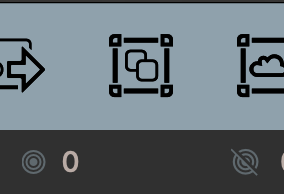
   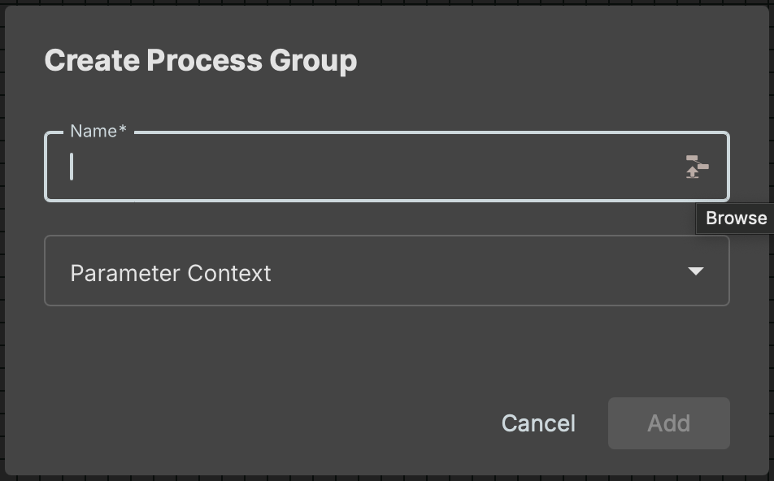
   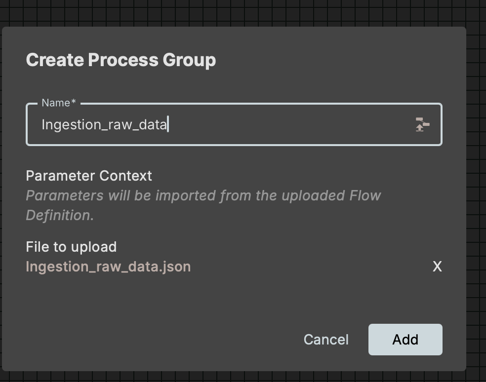

2. Open the `Ingestion_raw_data` group, then open the `file_ingestion_to_s3` sub-process.

   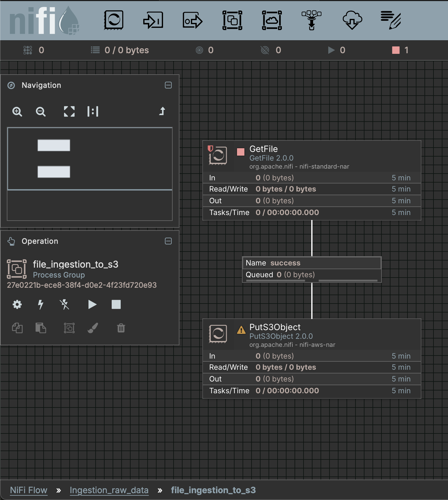

3. Open the `PutS3Object` processor, go to the Properties tab, and select **AWS Credentials Provider Services**. Click 'Go to Service'.

   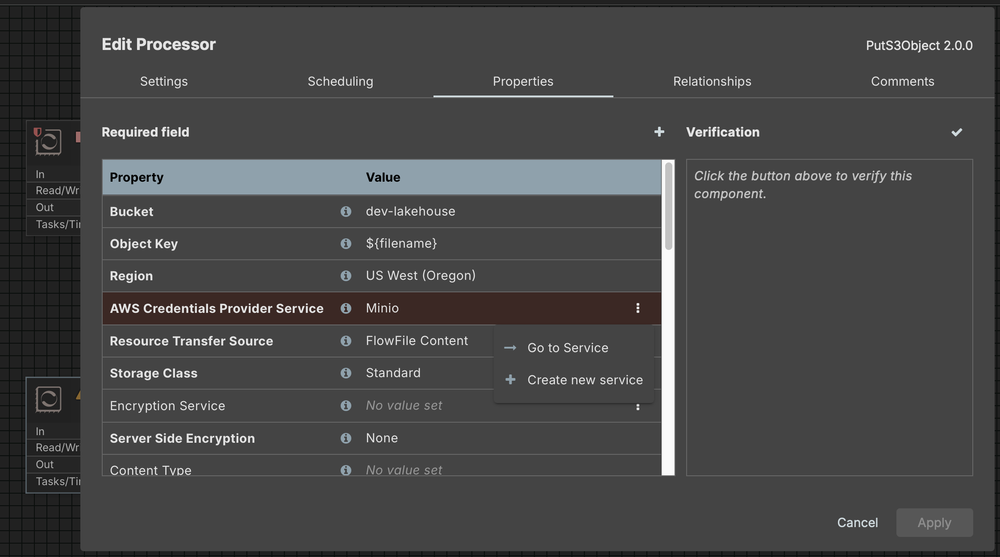
   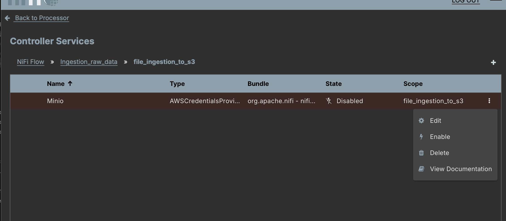

4. Add your Access and Secret Keys, then apply the changes.

   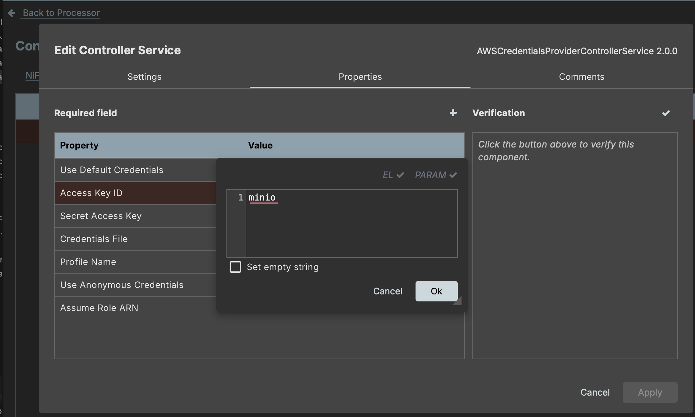
   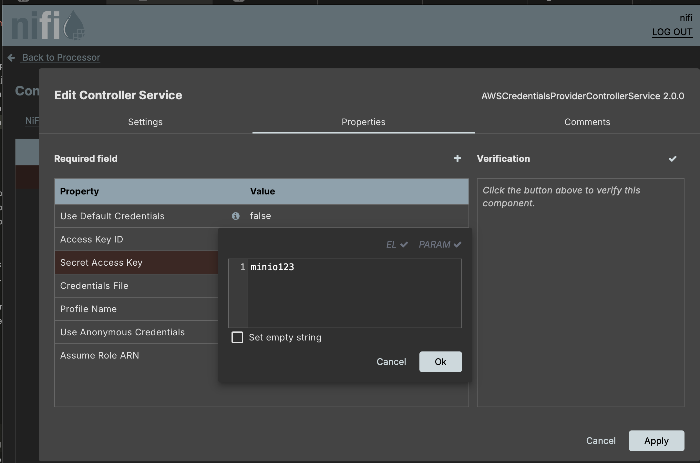

5. Enable the service with the scope 'Service and referencing components'.

   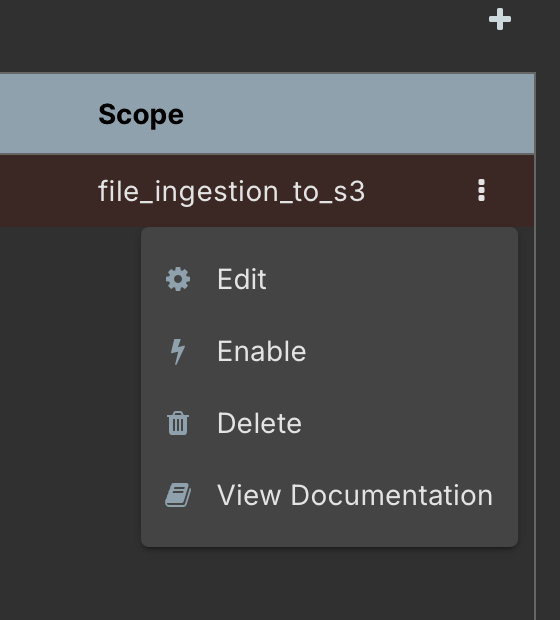
   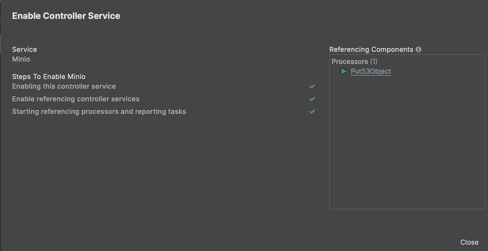

6. Close the service settings and return to the process group. The `PutS3Object` processor is now ready to send files to S3.

7. Start the `Ingestion_raw_data` process group.

   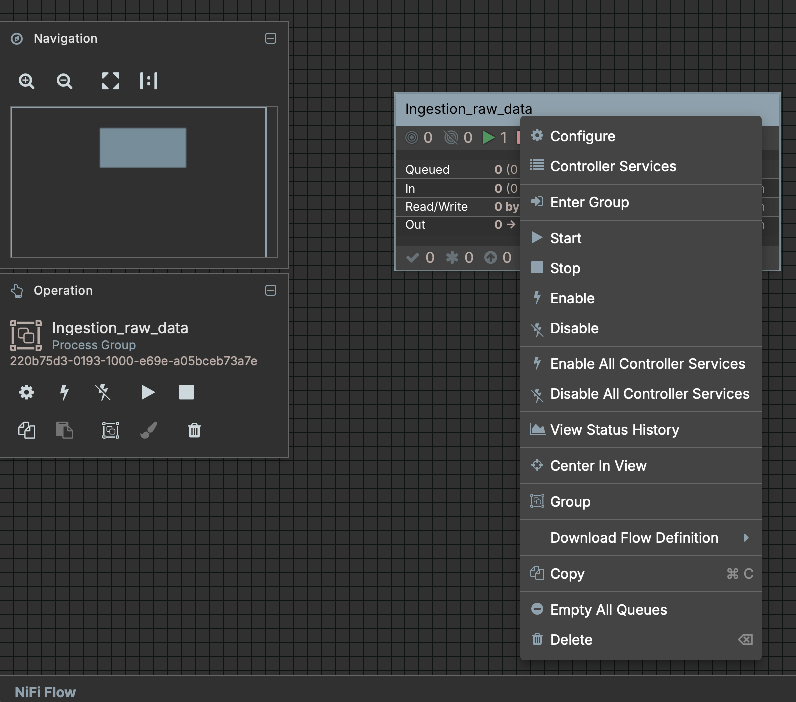

8. Place the CSV file (`docs/requirement/Invoices_Year_2009-2010.csv`) into the `datasources` folder in the project repository. The file will be automatically sent to MinIO under the `landing-zone` bucket, and the original file will be deleted.

   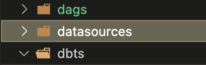

> **Note**: This approach is tailored to the file provided in the assessment. For different files, adjustments to the flow may be required.

### From Landing Zone on S3 to Bronze Layer

Execute the following command to launch Dremio:
```sh
docker compose --profile dremio up -d
```

- Dremio UI: [http://localhost:9047/](http://localhost:9047/)

#### Steps for Dremio Configuration

1. Access the Dremio UI and configure the admin properties as shown below:

   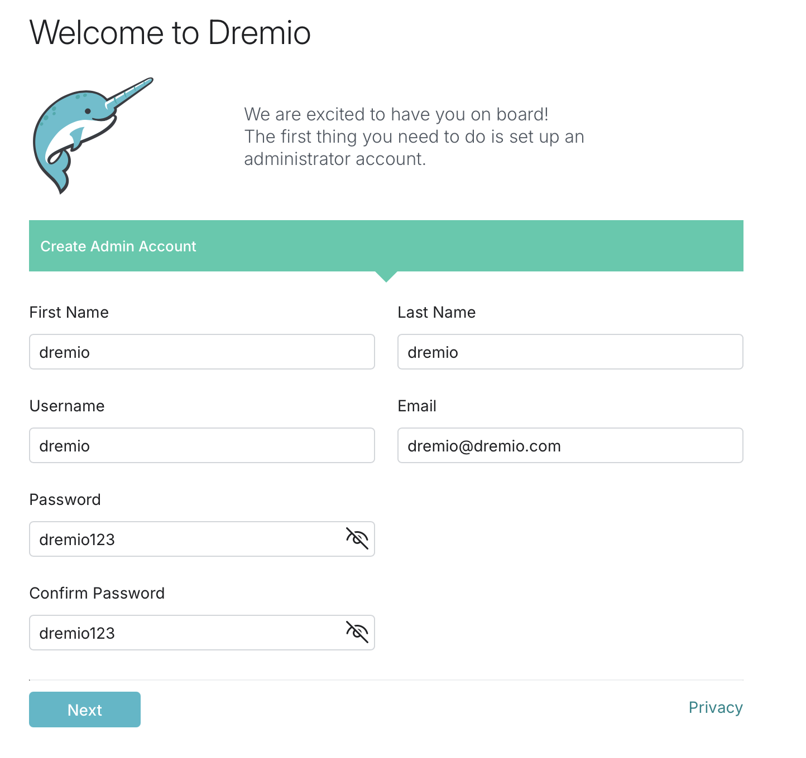
   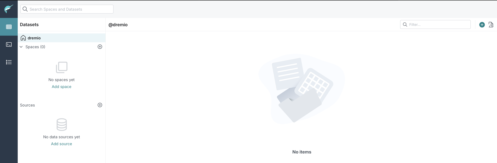

2. On the project repository:

   - Execute the Python script `scripts/dremio_add_sources.py` to add sources via the Dremio API.
   
   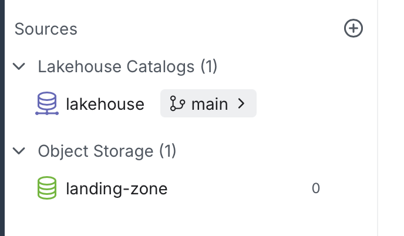

   - Run the Python script `scripts/dremio_converting_to_table.py` to convert the CSV file into a table.

3. The DBT project will handle all DML, DDL, and SQL operations. To run it, start Airflow and execute the DAG `dbt_refresh_data_warehouse_full_model`.

   ```sh
   docker compose --profile airflow up -d
   ```

4. The Data Lakehouse should now appear in Dremio, accessible through the UI or a DBeaver connection.

   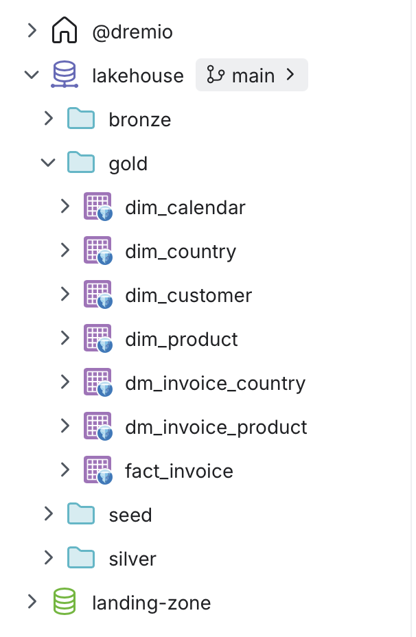

## Tools and Credentials

### NiFi

- URL: [https://localhost:8443/nifi/#/login](https://localhost:8443/nifi/#/login)
- **User**: nifi
- **Password**: nifi12345678

### Apache Nessie

- URL: [http://localhost:19120/t](http://localhost:19120/t)

### MinIO

- URL: [http://localhost:9001/](http://localhost:9001/)
- **User**: minio
- **Password**: minio123
